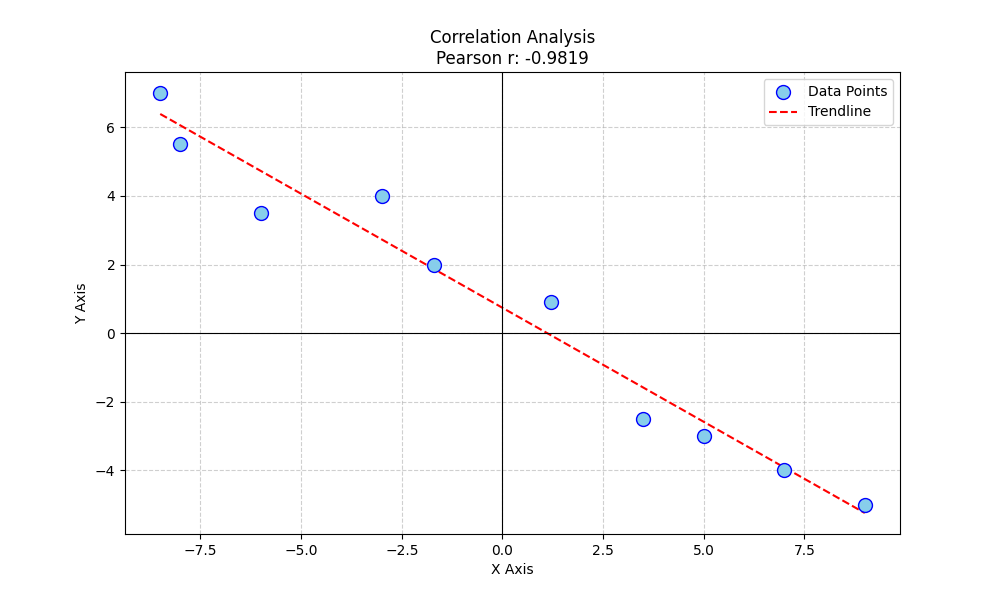
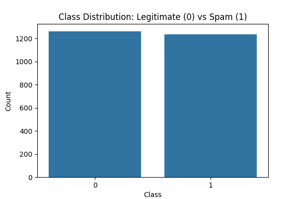

# aimlmid2026_1_baklaga

# Midterm Exam Report: AI and ML for Cybersecurity
**Student:** Luka Baklaga
**Date:** January 9, 2026

## Task 1: Finding the Correlation
**Data Source:** `max.ge/aiml_midterm/89734_html`

### Process Description
I accessed the online graph and manually extracted the coordinates for the 10 data points using the "მონაცემი" (Data) tooltips displayed on the screen. I then utilized Python's `scipy.stats` library to calculate Pearson's correlation coefficient.

* **Calculated Pearson's r:** -0.9819

### Visualization
The scatter plot below visualizes the data using the exact coordinates retrieved. The trendline confirms a very strong negative correlation.

---

## Task 2: Spam Email Detection
**Data Source:** `l_baklaga_89734.csv`

### 1. Data Loading and Processing
I loaded the dataset using Pandas. The file contained pre-extracted numerical features (`words`, `links`, `capital_words`, `spam_word_count`). I separated these features into the `X` variable and the target (`is_spam`) into the `y` variable. The data was split into 70% training and 30% testing sets.
**Link to Code:** [Link to spam_classifier.py]

### 2. Model Training
I trained a Logistic Regression model on the training set.
* **Coefficients Found:** The model identified that features like `links` and `spam_word_count` had high positive coefficients, indicating they are strong predictors of spam.

### 3. Validation
* **Accuracy:** 96.40%
* **Confusion Matrix:**
    [[377  10]
     [ 17 346]]
    *This indicates 377 legitimate emails and 346 spam emails were correctly identified, with very few errors.*

### 4. Manual Email Classification
I implemented a feature extraction function to parse raw text and count links, capital words, and trigger words (e.g., "free", "winner", "urgent") to match the model's expected input.

**A. Composed Spam Email**
* **Text:** "CONGRATULATIONS! You are a WINNER! Click here http://www.spamlink.com to claim your FREE PRIZE now. This involves huge MONEY and is an URGENT OFFER for you. BUY now and get a GIFT."
* **Prediction:** **SPAM**
* **Explanation:** This email contains a URL, multiple capitalized words ("CONGRATULATIONS", "WINNER", "MONEY"), and several spam trigger keywords defined in my extraction logic. The model correctly flagged it based on these high feature counts.

**B. Composed Legitimate Email**
* **Text:** "Hi Dave, Can we meet tomorrow at 10 AM to discuss the project updates? Let me know if that time works for you. Best, Sarah"
* **Prediction:** **LEGITIMATE**
* **Explanation:** This email represents a standard conversation. It contains zero links, no aggressive capitalization, and no spam keywords, resulting in a prediction of legitimate.

### 5. Visualizations
**A. Class Distribution**

*This bar chart shows the balance between spam and legitimate emails in the dataset.*

**B. Confusion Matrix Heatmap**

*The heatmap visualizes the model's high accuracy, with the dark blue diagonal squares representing correct predictions.*
